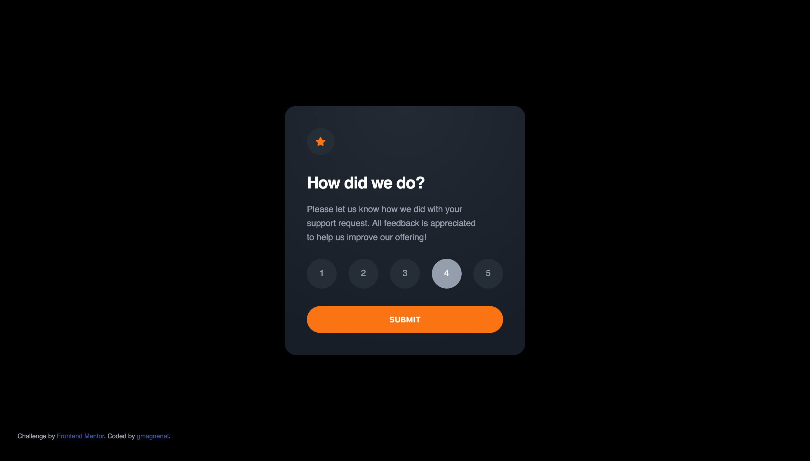

# Frontend Mentor - Interactive rating component solution

This is a solution to the [Interactive rating component challenge on Frontend Mentor](https://www.frontendmentor.io/challenges/interactive-rating-component-koxpeBUmI). Frontend Mentor challenges help you improve your coding skills by building realistic projects.

## Table of contents

- [Overview](#overview)
  - [The challenge](#the-challenge)
  - [Screenshot](#screenshot)
  - [Links](#links)
- [My process](#my-process)
  - [Built with](#built-with)
  - [What I learned](#what-i-learned)
  - [Continued development](#continued-development)
- [Author](#author)

## Overview

### The challenge

Users should be able to:

- View the optimal layout for the app depending on their device's screen size
- See hover states for all interactive elements on the page
- Select and submit a number rating
- See the "Thank you" card state after submitting a rating

### Screenshot

### Links

- Solution URL: [Add solution URL here](https://www.frontendmentor.io/solutions/interactive-rating-component-html-css-sass-js-5wLf4u8UxO)
- Live Site URL: [Add live site URL here](https://chic-daifuku-dacf07.netlify.app/)

## My process

### Built with

- Semantic HTML5 markup
- CSS custom properties
- Flexbox
- Sass
- JavaScript

### What I learned

Setup a simple build system to work with sass, compile files, minify files for production.

### Continued development

Work on better markup structure with new html5 elements.
Learn more about BEM.
Learn more about sass folders and file structures.
Learn more about sass mixins.
Learn more about css custom properties.

## Author

- Website - [Gwenaël Magnenat](https://github.com/gmagnenat)
- Frontend Mentor - [@yourusername](https://www.frontendmentor.io/profile/gmagnenat)
- Twitter - [@magnenatg](https://www.twitter.com/magnenatg)
